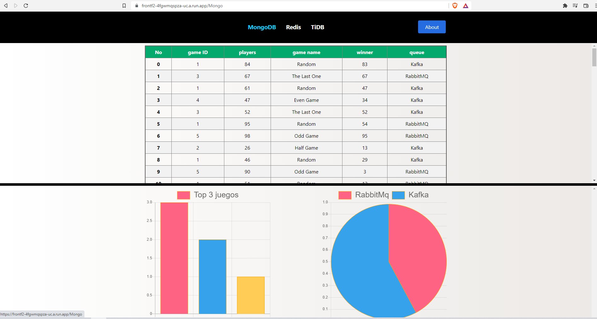

# Manual de Usuario
---


### Requisitos para usar el proyecto

- Sistema Operativo Libre

--- 
## Interfaz

Para poder visualizar la aplicación web se debe acceder al siguiente enlace

```
https://frontf2-4fgwmqspza-uc.a.run.app/
```
Esta sera la vista principal, la cual tiene un menu de navegacion a traves del cual se pueden elegir ver:

- Logs y estadisticas generales (MongoDB)
- Estadisticas de los juegos (Redis y TiDB)


---

### Logs y estadisticas generales


Aca se puede observar los Logs almacenados en la base de datos, estos desplegados una tabla para su facil entendimiento.

Posteriormente se observa un Top de los 3 juegos mas recurrentes en una grafica de barras y la recurrencia de uso de las colas Kafka y RabbitMQ en una grafica de Pie.



---
### Resultados de Juegos


En la pestaña "TiDB" se puede apreciar lo siguientes reportes, cada uno de estos se actualizan en tiempo real:

- Ultimos 10 juegos

Aqui se muestra una tabla con los ultimos 10 juegos que se emplearon.


- Top 10 Jugadores

Aca se muestra una tabla con un ranking de los 10 jugadores con mayor numero de victorias en orden descendente


- Estadisticas de los jugadores

En este reporte se aprecia cada uno de los jugadores y su numero de victorias


